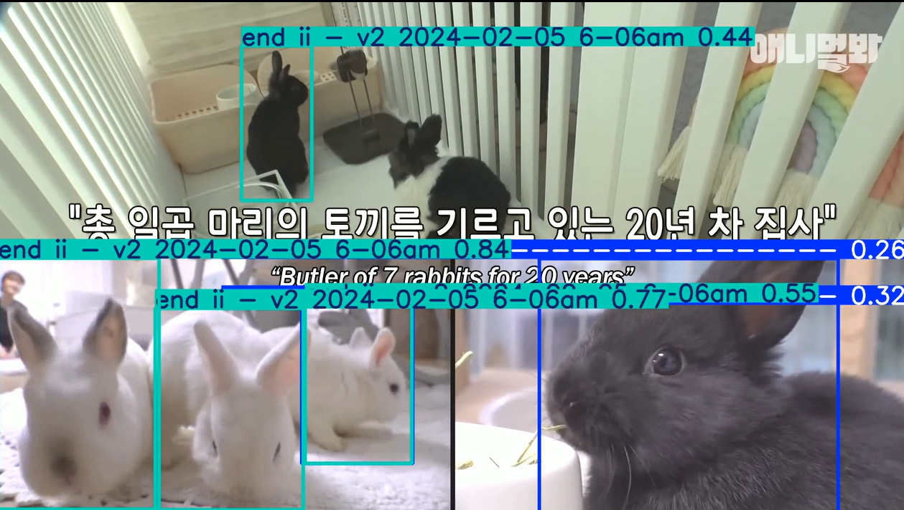

# YOLOv8 기반 실시간 객체 탐지 – 토끼 & 펭귄 객체 탐지

이 프로젝트는 최신 객체 탐지 모델인 **YOLOv8**을 사용하여 토끼와 펭귄을 탐지하는 객체 탐지 모델을 구현한 것입니다. Roboflow를 활용해 데이터셋을 준비하고, 로컬 및 API 방식으로 추론을 수행합니다.

## 프로젝트 구조

```
.
├── data
│   ├── rabbit_dataset
│   └── penguin_dataset
├── scripts
│   ├── rabbit
│   │   ├── download_rabbit_dataset.py
│   │   ├── run_api_inference.py
│   │   ├── run_local_inference.py
│   │   ├── run_training.py
│   └── penguin
│       ├── download_penguin_dataset.py
│       ├── run_api_inference.py
│       ├── run_local_inference.py
│       ├── run_training.py
├── raw_videos
│   ├── rabbit_original.mp4
│   └── penguin_original.mp4
├── trained_models
│   ├── penguin_best_model.pt
│   └── rabbit_trained_model.pt
├── results/             # 추론 결과 동영상 저장
│   ├── rabbit_api_detected.mp4
│   ├── rabbit_local_detected.mp4
│   ├── penguin_api_detected.mp4
│   └── penguin_local_detected.mp4
└── requirements.txt
```

## 사용 방법

### 1. 필요 라이브러리 설치

프로젝트 실행에 필요한 라이브러리를 `requirements.txt` 파일을 통해 한 번에 설치합니다.

```bash
pip install -r requirements.txt
```

### 2. 데이터셋 다운로드 (선택 사항)

데이터셋이 없는 경우, Roboflow에서 제공하는 데이터셋을 다운로드할 수 있습니다. 각 스크립트는 `data` 폴더 내에 해당 동물의 데이터셋을 다운로드합니다.

```bash
# 토끼 데이터셋 다운로드
python scripts/rabbit/download_rabbit_dataset.py

# 펭귄 데이터셋 다운로드
python scripts/penguin/download_penguin_dataset.py
```

### 3. 모델 학습 (선택 사항)

`trained_models` 폴더에 이미 학습된 모델이 제공되지만, `run_training.py` 스크립트를 실행하여 자신만의 객체 탐지 모델을 만들 수 있습니다.

**실행 방법:**

```bash
# 토끼 모델 학습 (yolov8n.pt 기반)
python scripts/rabbit/run_training.py

# 펭귄 모델 학습 (yolov8n.pt 기반)
python scripts/penguin/run_training.py
```

### 4. 추론 실행

동영상에서 객체 탐지를 수행하는 방법은 **로컬 추론**과 **API 추론** 두 가지가 있습니다.

#### 4.1. 로컬(Local) 추론

사용자의 컴퓨터 환경에서 직접 학습된 모델을 사용하여 추론을 수행합니다.

**실행 방법:**

```bash
# 토끼 영상 로컬 추론
python scripts/rabbit/run_local_inference.py

# 펭귄 영상 로컬 추론
python scripts/penguin/run_local_inference.py
```

#### 4.2. Roboflow API 추론

Roboflow에 호스팅된 모델을 사용하여 API를 통해 추론을 수행합니다. `run_api_inference.py` 스크립트 내의 `ROBOFLOW_API_KEY`를 자신의 키로 변경해야 합니다.

**실행 방법:**

```bash
# 토끼 영상 API 추론
python scripts/rabbit/run_api_inference.py

# 펭귄 영상 API 추론
python scripts/penguin/run_api_inference.py
```

## 실행 결과 예시

프로젝트의 객체 탐지 실행 결과 예시입니다.



## 상세 문서 (PDF)

이 프로젝트에 대한 더 자세한 내용은 다음 PDF 문서를 참조해 주세요:
[전체 포트폴리오 보기](https://docs.google.com/viewer?url=https://github.com/hangawi/roboflow_yolo/raw/master/image/%EC%83%81%EC%84%B8%20%EB%AC%B8%EC%84%9C.pdf)
